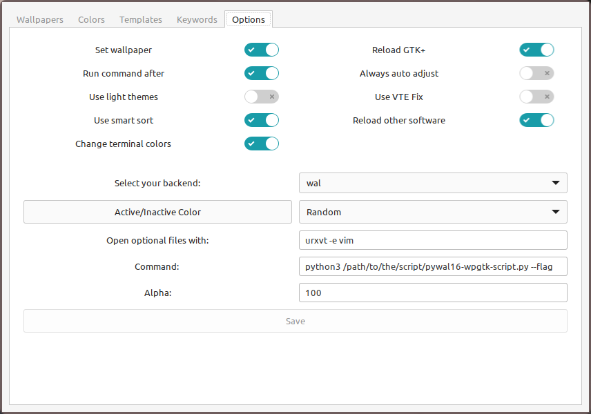

# pywal16-wpgtk-script

A simple script to enable the use of pywal 16 colors in wpgtk.

## Installation 

Clone the repo
```bash
git clone https://github.com/EJ-PJ/pywal16-wpgtk-script.git
```

In your configuration file of wpgtk `wpg.conf`, change the value of the `execute_cmd` setting to `true`.

```bash
execute_cmd = true
```

And set the `command` value to the path of the python script `pywal16-wpgtk-script.py`.

```bash
command = python3 /path/where/you/clone/the/repo/pywal16-wpgtk-script.py --flag/s
```

Or directly use the `Options` tab in the wpg GUI by enabling the `Run command after` 
option and editing the `Command` entry by setting the the path of the python script.




## Usage 

By passing the flag to the script you can ither choose between `darken` or `lighten` 

```bash
pywal16-wpgtk-script.py [--cols16 [method]] [--contrast [1.0-21.0]] [-w] [--recursive]

options:
    -h, --help            show this help message and exit
    --cols16 [method]     Use 16 color output "darken" or "lighten" default: darken"
    --contrast [1.0-21.0]
			  Specify a minimum contrast ratio between pallete colors and the source image according to W3 contrast specifications. Values between 1.5-4.5
			  typically work best.
    -w                    Use last used wallpaper for color generation.
    --recursive           When pywal is given a directory as input and this flag is used: Search for images recursively in subdirectories instead of the root only.
```
